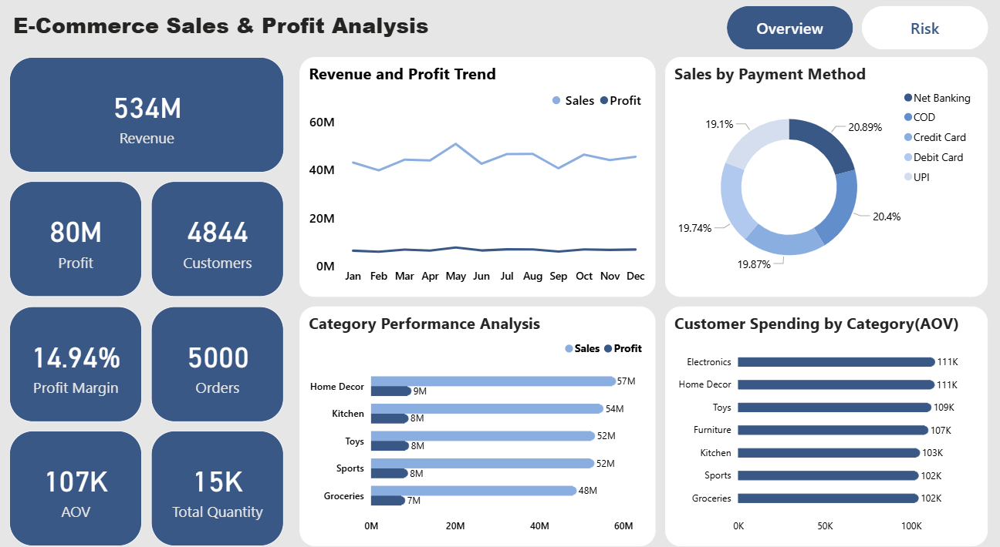
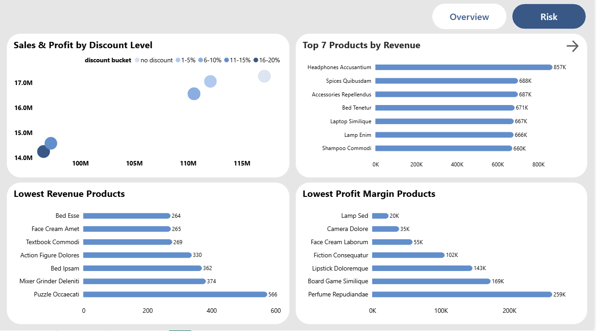
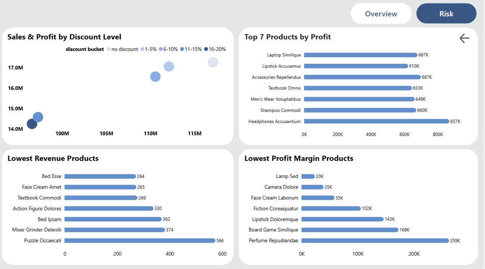

## 📌 Project Background

The e-commerce dataset represents transactional sales data across multiple product categories, customers, and payment modes. 

This project transforms raw e-commerce transactional data into a structured business intelligence solution using **SQL, and Power BI**, focusing on data cleaning, validation, exploratory analysis, and executive-level reporting.

The primary objective is to analyze **sales performance, profitability, discount impact, product risk, and customer purchasing behavior** to support data-driven business decisions.

## 🧱 Data Structure & Initial Checks

### Dataset Details

- **Domain:** E‑Commerce  
- **Format:** CSV  
- **Records:** ~5,000 rows  
- **Source:** Transaction‑level sales data  

### Key Columns

**Dimensions:**  
Order_Date, Product_Name, Category, Payment_Mode, Customer_Name  

**Measures:**  
Sales, Profit, Profit_Margin, Quantity, Discount  

### Initial Data Quality Checks

- Row count validation  
- Duplicate record detection  
- Identification of missing and invalid values  
- Datatype consistency checks  
- Format validation for categorical fields  

## Power BI Dashboard
The dashboard provides business insights through:
- Total Revenue, Profit, and Profit Margin KPIs  
- Monthly Sales and Profit Trend Analysis  
- Category Performance Comparison  
- Sales Distribution by Payment Method  
- Average Order Value (AOV)  
- Top & Bottom Products by Revenue and Profit  
- Discount and Profit Risk Analysis  

An interactive Power BI dashboard (Overview,  Risk Analysis pages) can be downloaded [here](powerbi/ecommerce_sales_project.pbix)

### The SQL queries used for EDA and preprocessing can be found in:
Initial Data Checks: [here](sql/data_cleaning_checks.sql)

Cleaning & Preparation: [here](sql/data_cleaning.sql)

Exploratory Data Analysis: [here](sql/eda.sql)

Business Questions: [here](sql/Business_questions.sql)

## Executive Summary:
**Overview of findings:**
- Total revenue reached **534M** with an overall profit of **80M**, resulting in a **14.94% profit margin**
- The business processed **5,000 orders** from **4,844 customers**, indicating a strong and consistent customer base
- Monthly sales and profit trends remain stable throughout the year, showing steady demand without major fluctuations
- Home Decor and Electronics emerge as the strongest revenue-generating categories
- Average Order Value (AOV) remains balanced across categories, reflecting consistent customer spending behavior
- Overall performance indicates stable growth, diversified revenue streams, and sustainable profitability

### Overview Page

**Risk Analysis:**
- Moderate discount levels (**6–10% and 11–15%**) contribute positively to both sales volume and profitability.
- Higher discount ranges (**16–20%**) increase revenue but significantly reduce profit margins, indicating margin erosion risk.

- Several products generate high revenue but contribute low profit margins, highlighting potential inefficiencies in pricing strategy.
- Low-revenue and low-profit-margin products represent underperforming inventory that may require repricing, promotion, or discontinuation.

- The risk insights support data-driven decisions around **discount optimization, product rationalization, and margin improvement strategies**.

### Risk Analysis Page

## 📌  Recommendations
- Focus on moderate discount levels (6–15%) to achieve a balance between sales growth and sustainable profitability while avoiding margin erosion from heavy discounting.

- Focus on margin optimization by controlling discount levels and costs, as profit has declined despite stable sales and no loss-making products.

- Regularly monitor profit margins, discount impact, and underperforming products through dashboards to enable proactive, data-driven decision-making.

## 🛠️ Tools & Technologies

- **MySQL**  
  Used for data import, schema validation, data cleaning, data quality checks, data transformation, and exploratory analysis, including aggregations, filtering, grouping, and conditional logic.

- **Power BI**  
  Used for creating interactive dashboards and visual reports from cleaned SQL data.

- **DAX**  
  Implemented for KPI calculations such as Total Sales, Profit, Profit Margin, Average Order Value (AOV), and trend analysis.
 

## ✅ Conclusion
This project demonstrates an end-to-end e-commerce sales analysis, transforming raw data into actionable business insights through structured SQL analysis and interactive Power BI dashboards. The findings highlight the importance of balanced discount strategies, product-level profitability monitoring, and risk-aware decision-making to support sustainable business growth.
